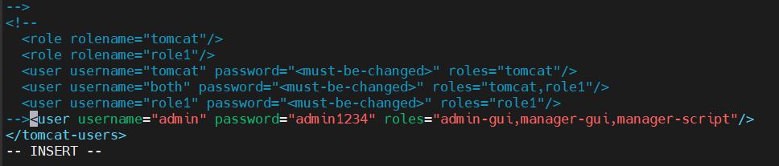

### Apache Tomcat: Overview and Usage

#### What is Apache Tomcat?

Apache Tomcat is an open-source web server and servlet container developed by the Apache Software Foundation. It is primarily used to deploy Java Servlets, JavaServer Pages (JSP), and WebSocket applications. Tomcat provides a "pure Java" HTTP web server environment in which Java code can run, making it an ideal choice for Java-based web applications.

#### Key Features of Apache Tomcat:
- **Java Servlet & JSP Support**: Tomcat is specifically designed to run Java Servlets and JSPs, allowing developers to create dynamic web content with Java.
- **WebSocket Support**: Tomcat supports the WebSocket protocol, which allows for real-time communication between the server and clients.
- **High Compatibility**: Tomcat is compatible with various Java frameworks like Spring, Struts, and Hibernate.
- **Lightweight**: Compared to full-fledged application servers like JBoss or WebLogic, Tomcat is lightweight and easier to set up and manage.
- **Extensible and Pluggable**: Tomcat allows the integration of additional components, enabling a high degree of customization and extensibility.

### How is Tomcat Different from Nginx?

**Purpose and Use-Cases:**

- **Apache Tomcat** is primarily used as a Java application server. It is designed to serve Java Servlets, JSP, and WebSocket-based applications. If your project involves running Java-based web applications, Tomcat is an excellent choice.

- **Nginx** (pronounced as "Engine-X") is a web server, reverse proxy server, load balancer, and HTTP cache. Nginx excels at serving static content (HTML, CSS, JS, images) and acting as a reverse proxy for dynamic content generated by other servers (e.g., Tomcat, Node.js, Django). Nginx is known for its high performance, scalability, and low resource consumption.

**Handling Requests:**

- **Tomcat** is designed to handle HTTP requests and responses for Java applications. It’s equipped to manage Java servlets, JSPs, and related technologies, which involve processing server-side Java code.

- **Nginx** is designed to efficiently handle a large number of concurrent connections, making it ideal for serving static content and load balancing. It uses an event-driven, non-blocking architecture that handles multiple requests within a single thread, which is different from the thread-per-request model used by traditional web servers.

**Performance:**

- **Tomcat** is optimized for serving dynamic content generated by Java applications. However, it may not perform as well as Nginx when it comes to serving static content or handling a large number of concurrent connections.

- **Nginx** is optimized for performance, especially in serving static content and handling high concurrency. It is often used as a reverse proxy in front of application servers like Tomcat to serve static content and balance the load.

### When to Use Nginx, Tomcat, or Apache HTTP Server?

**1. When to Use Apache Tomcat:**
- **Java-Based Web Applications**: If your application is written in Java and uses Servlets, JSP, or WebSocket, Tomcat is the best choice.
- **Java Frameworks**: For applications developed with Java frameworks like Spring or Struts, Tomcat provides a compatible and robust server environment.
- **Standalone Application Server**: If your application doesn’t require the full features of a complete Java EE server, Tomcat is a lightweight and efficient alternative.

**2. When to Use Nginx:**
- **Serving Static Content**: Nginx excels at serving static files (HTML, CSS, JavaScript, images) with high efficiency.
- **Reverse Proxy and Load Balancing**: Nginx is often used as a reverse proxy to distribute incoming traffic to different application servers, including Tomcat, thereby improving performance and availability.
- **High Concurrency Applications**: For applications that require handling thousands of concurrent connections, Nginx’s event-driven architecture makes it an ideal choice.
- **API Gateway**: Nginx can be used as an API gateway, managing and routing traffic to different backend services.

**3. When to Use Apache HTTP Server:**
- **General Web Hosting**: Apache HTTP Server is a general-purpose web server capable of serving static and dynamic content. It’s versatile and supports a wide range of modules for different functionalities.
- **PHP or Other Dynamic Content**: Apache is a good choice if you’re serving dynamic content generated by languages like PHP, Python (with mod_wsgi), or Perl.
- **Compatibility and Flexibility**: Apache is highly configurable and supports a vast array of plugins, making it suitable for a variety of environments.

**Common Deployment Scenarios:**
- **Nginx + Tomcat**: Nginx can be used as a reverse proxy in front of Tomcat. In this setup, Nginx handles all incoming HTTP requests, serving static content directly and forwarding dynamic requests to Tomcat. This setup leverages Nginx’s performance with static files and Tomcat’s Java capabilities.
- **Nginx + Apache HTTP Server**: Nginx can act as a reverse proxy for Apache, handling static content and SSL termination, while Apache processes dynamic content through its various modules.
- **Standalone Tomcat**: For pure Java-based applications, Tomcat can be used as a standalone server, especially when the application does not require handling a large amount of static content.

### Summary

Choosing between Tomcat, Nginx, and Apache HTTP Server depends on the specific needs of your application:
- Use **Tomcat** for Java-based applications requiring a servlet container.
- Use **Nginx** for high-performance, high-concurrency static content serving, or as a reverse proxy/load balancer.
- Use **Apache HTTP Server** for general-purpose web hosting with flexibility and module support for different languages and environments.


# Install tools on linux
just type `java` and `mvn` if its not install you will get the command to install if only its in apt repo
- java
- maven

example
```sh
mvn
Command 'mvn' not found, but can be installed with:
sudo apt install maven

java
Command 'java' not found, but can be installed with:
sudo apt install openjdk-17-jre-headless  # version 17.0.16+8~us1-0ubuntu1~24.04.1, or
sudo apt install openjdk-21-jre-headless
```

## Why it happens with openjdk-17-jre-headless
```sh
No JRE found. Skipping Java certificates setup.
```
Headless JRE = stripped-down runtime with no GUI libraries (no awt, swing etc.) → good for servers.

In some Linux distros, the -headless variant doesn’t ship with the same layout as a “full” JRE (/lib/security/cacerts may be missing).

Fix
```sh
# option one
sudo apt remove openjdk-17-jre-headless -y
sudo apt install openjdk-17-jre -y
```
jre → gives you the Java Runtime Environment (JVM + standard libraries) ✅

headless → means it does not include GUI components (like AWT, Swing, JavaFX).

- Some Java-based tool or package installer trying to configure certificates (for HTTPS / SSL).
- It checks for JAVA_HOME or a JRE path, and if it doesn’t find it → assumes “No JRE found.”
- This doesn’t mean your JRE is missing — it means the script didn’t detect it correctly.

```sh
# option two: Keep headless, manually fix certs
sudo apt install ca-certificates-java -y
sudo update-ca-certificates -f
```

```sh
java -version
mvn -version
```

# Apache Tomcat 9.0.65 Installation and Configuration Guide

This guide provides step-by-step instructions for installing Apache Tomcat 9.0.65 on a Linux system, configuring the server, and setting up administrative access.

## Table of Contents

- [Install tools on linux](#install-tools-on-linux)
  - [Why it happens with openjdk-17-jre-headless](#why-it-happens-with-openjdk-17-jre-headless)
- [Apache Tomcat 9.0.65 Installation and Configuration Guide](#apache-tomcat-9065-installation-and-configuration-guide)
  - [Table of Contents](#table-of-contents)
  - [Prerequisites](#prerequisites)
  - [Installation Steps](#installation-steps)
    - [1. Download and Extract Tomcat](#1-download-and-extract-tomcat)
    - [2. Configure Tomcat Users](#2-configure-tomcat-users)
    - [3. Create Start and Stop Scripts](#3-create-start-and-stop-scripts)
    - [4. Modify Access Restrictions](#4-modify-access-restrictions)
  - [Starting and Stopping Tomcat](#starting-and-stopping-tomcat)
    - [1️⃣ How Maven knows what type to package](#1️⃣-how-maven-knows-what-type-to-package)
    - [We need to move the .war file to webapps](#we-need-to-move-the-war-file-to-webapps)
- [🚀 Maven → Tomcat Deployment Flow](#-maven--tomcat-deployment-flow)
  - [1️⃣ Maven Determines the Output Name](#1️⃣-maven-determines-the-output-name)
  - [2️⃣ Where It Is in Tomcat](#2️⃣-where-it-is-in-tomcat)
  - [3️⃣ Exploded vs WAR Deployment](#3️⃣-exploded-vs-war-deployment)
  - [4️⃣ How to Change the URL / Context Path](#4️⃣-how-to-change-the-url--context-path)
  - [5️⃣ Maven `pom.xml` Metadata](#5️⃣-maven-pomxml-metadata)
    - [Properties](#properties)
  - [✅ Summary: How `hello-world` Became the URL](#-summary-how-hello-world-became-the-url)
  - [🌐 Deployment Flow Diagram](#-deployment-flow-diagram)
  - [License](#license)

## Prerequisites

- A Linux-based operating system with `sudo` privileges.
- Basic knowledge of Linux command-line operations.

## Installation Steps

### 1. Download and Extract Tomcat

1. **Switch to the root user:**

   ```bash
   sudo su
   ```

2. **Navigate to the `/opt` directory:**

   ```bash
   cd /opt
   ```

3. **Download the Apache Tomcat 9.0.65 tarball:**

   ```bash
   sudo wget https://archive.apache.org/dist/tomcat/tomcat-9/v9.0.65/bin/apache-tomcat-9.0.65.tar.gz
   ```

4. **Extract the downloaded tarball:**

   ```bash
   sudo tar -xvf apache-tomcat-9.0.65.tar.gz
   ```

### 2. Configure Tomcat Users

1. **Navigate to the Tomcat configuration directory:**

   ```bash
   cd /opt/apache-tomcat-9.0.65/conf
   ```

2. **Edit the `tomcat-users.xml` file to add an admin user:**

   ```bash
   sudo vi tomcat-users.xml
   ```

3. **Add the following line before the closing `</tomcat-users>` tag:**

   ```xml
   <user username="admin" password="admin1234" roles="admin-gui,manager-gui,manager-script"/>
   ```
   

   This creates an admin user with the username `admin` and the password `admin1234`. The user is assigned roles that allow access to the administrative and management interfaces.

### 3. Create Start and Stop Scripts

1. **Create symbolic links for the Tomcat start and stop scripts:**

   ```bash
   sudo ln -s /opt/apache-tomcat-9.0.65/bin/startup.sh /usr/bin/startTomcat
   sudo ln -s /opt/apache-tomcat-9.0.65/bin/shutdown.sh /usr/bin/stopTomcat
   ```
These links allow you to start and stop Tomcat using the `startTomcat` and `stopTomcat` commands from any directory.

⚖️ Best Practices
- /usr/bin → usually reserved for OS package manager stuff.
- /usr/local/bin → preferred for your own apps / symlinks.

### 4. Modify Access Restrictions

1. **Edit the `context.xml` file for the Manager web application:**

   ```bash
   sudo vi /opt/apache-tomcat-9.0.65/webapps/manager/META-INF/context.xml
   ```

2. **Comment out the `RemoteAddrValve` configuration:**

   ```xml
   <!--
   <Valve className="org.apache.catalina.valves.RemoteAddrValve"
   allow="127\.\d+\.\d+\.\d+|::1|0:0:0:0:0:0:0:1" />
   -->
   ```

   This change removes the restriction that only allows access to the Manager application from localhost and accept access from everywhere.

3. **Edit the `context.xml` file for the Host Manager web application:**

   ```bash
   sudo vi /opt/apache-tomcat-9.0.65/webapps/host-manager/META-INF/context.xml
   ```

4. **Comment out the `RemoteAddrValve` configuration:**

   ```xml
   <!--
   <Valve className="org.apache.catalina.valves.RemoteAddrValve"
   allow="127\.\d+\.\d+\.\d+|::1|0:0:0:0:0:0:0:1" />
   -->
   ```

   This change removes the restriction that only allows access to the Host Manager application from localhost.

## Starting and Stopping Tomcat

- **To stop Tomcat:**

  ```bash
  sudo stopTomcat
  ```

- **To start Tomcat:**

  ```bash
  sudo startTomcat
  ```

```sh
cd ~

git clone <git-url>

cd Java-Tomcat-Deployment 

mvn package

[INFO] Packaging webapp
[INFO] Assembling webapp [hello-world] in [/home/ubuntu/Java-Tomcat-Deployment/target/hello-world]
[INFO] Processing war project
[INFO] Copying webapp resources [/home/ubuntu/Java-Tomcat-Deployment/src/main/webapp]
[INFO] Building war: /home/ubuntu/Java-Tomcat-Deployment/target/hello-world.war
[INFO]
```
copy
```sh
sudo cp /home/ubuntu/Java-Tomcat-Deployment/target/hello-world.war /opt/apache-tomcat-9.0.65/webapps/
```

### 1️⃣ How Maven knows what type to package

Maven decides whether to build a .jar or .war (or other types) based on your project's pom.xml configuration, specifically the <packaging> element:
```xml
<project>
    ...
    <packaging>war</packaging>
    ...
</project>
```
jar → builds a .jar file (default if not specified).

war → builds a .war file for web applications.

There are other types too (pom, ear, ejb), but .jar and .war are most common.

If you don’t specify <packaging>, Maven defaults to jar.

These commands will control the Tomcat server's operation.

### We need to move the .war file to webapps
```sh
cd /opt/apache-tomcat-9.0.65/
``


# 🐱‍💻 Apache Tomcat Folder Structure

Here’s a quick guide to what each file and folder in a Tomcat installation contains and which ones are most important.

---

## 📄 Top-level files

| File | Purpose | Important? |
|------|--------|------------|
| `BUILDING.txt` | Instructions for building Tomcat from source | ❌ Only needed if building from source |
| `CONTRIBUTING.md` | Guidelines for contributing to Tomcat | ❌ For developers only |
| `LICENSE` | Apache License 2.0 | ⚪ Info only |
| `NOTICE` | Legal notices about dependencies | ⚪ Info only |
| `README.md` | General info about Tomcat | ⚪ Helpful for beginners |
| `RELEASE-NOTES` | Changes in each release | ⚪ Optional |
| `RUNNING.txt` | Basic instructions to run Tomcat | ⚪ Important for first-time use |

---

## 📂 Important directories

| Directory | Purpose | Notes / Importance |
|-----------|--------|------------------|
| `bin` | Scripts to start/stop Tomcat (`startup.sh`, `shutdown.sh`) | ✅ Most important for running Tomcat |
| `conf` | Main configuration files (`server.xml`, `web.xml`, `tomcat-users.xml`, `context.xml`) | ✅ Critical for configuring ports, users, apps, security |
| `lib` | Core Java libraries (`catalina.jar`, `servlet-api.jar`) | ⚪ Important for internal Tomcat functionality |
| `logs` | Tomcat logs (`catalina.out`, access logs) | ✅ Important for debugging |
| `temp` | Temporary runtime files | ⚪ Usually auto-managed |
| `webapps` | Default location for deployed web applications (`ROOT`, `manager`, your apps) | ✅ Most important for hosting apps |
| `work` | Stores compiled JSP files & serialized session data | ⚪ Auto-managed but important for performance |

---

## ⚡ Quick Notes

- **Run Tomcat:**  
  ```bash
  ./bin/startup.sh   # Start
  ./bin/shutdown.sh  # Stop
```

# 🚀 Maven → Tomcat Deployment Flow

This note explains **how a Maven project gets packaged and deployed to Tomcat**, including how the URL path is determined.

---

## 1️⃣ Maven Determines the Output Name

When you build a project with Maven:

```bash
mvn package
```

* Maven reads the `pom.xml` file.
* The **artifact name** comes from:

```xml
<groupId>com.example</groupId>
<artifactId>hello-world</artifactId>
<version>1.0-SNAPSHOT</version>
<packaging>war</packaging>
```

* The **artifactId** (`hello-world`) becomes the **name of the output folder** and the **.war file**:

```
target/hello-world/          # 📂 exploded folder (classes + resources)
target/hello-world.war       # 🗜 packaged WAR file
```

✅ That’s why you see `hello-world` and `hello-world.war` in `target/`.

---

## 2️⃣ Where It Is in Tomcat

Tomcat serves web applications from:

```
$CATALINA_HOME/webapps/
```

* In your case:

```
$CATALINA_HOME = /opt/apache-tomcat-9.0.65
```

* By default, Tomcat deploys any WAR file or folder inside `webapps/` automatically.
* The **context path** (part after `http://host:8080/`) comes from the WAR or folder name:

```
webapps/hello-world.war  → 🌐 accessible at http://<host>:8080/hello-world
```

So your URL:

```
http://52.90.59.244:8080/hello-world
```

…is **directly derived from the artifactId** of your Maven project.

---

## 3️⃣ Exploded vs WAR Deployment

* `hello-world/` → 📂 exploded directory: Tomcat can run it directly without re-extracting the WAR.
* `hello-world.war` → 🗜 packaged WAR file: Tomcat will unpack it automatically into `webapps/hello-world/` when it starts.

You can copy either to Tomcat:

```bash
cp target/hello-world.war /opt/apache-tomcat-9.0.65/webapps/
```

Tomcat will then serve it at:

```
http://<host>:8080/hello-world
```

---

## 4️⃣ How to Change the URL / Context Path

If you want a different URL than `hello-world`:

1. **Rename the WAR file before deploying:**

```bash
cp target/hello-world.war /opt/apache-tomcat-9.0.65/webapps/myapp.war
```

→ Accessible at:

```
http://<host>:8080/myapp
```

2. **Or configure `<Context>`** in `conf/server.xml` or a separate `META-INF/context.xml`.

---

## 5️⃣ Maven `pom.xml` Metadata

```xml
<modelVersion>4.0.0</modelVersion>
<groupId>com.example</groupId>
<artifactId>hello-world</artifactId>
<packaging>war</packaging>
<name>hello-world</name>
<version>1.0-SNAPSHOT</version>
<description>hello-world</description>
```

* **groupId** → 📦 package namespace (not used in URL/WAR name)
* **artifactId** → 🏷 key name for WAR, exploded folder, and Tomcat context path ✅
* **version** → optional in filename (e.g., `hello-world-1.0-SNAPSHOT.war`)
* **packaging** → tells Maven to use the WAR plugin 🗜
* **name** → metadata for IDEs/reports 📝

### Properties

```xml
<properties>
  <java.version>1.8</java.version>
  <maven.compiler.plugin.version>3.8.1</maven.compiler.plugin.version>
  <jetty-maven-plugin.version>9.4.43.v20210629</jetty-maven-plugin.version>
  <cargo-maven-plugin.version>1.8.8</cargo-maven-plugin.version>
  <maven.war.plugin.version>3.3.2</maven.war.plugin.version>
</properties>
```

* Define Java version, compiler plugin, and deployment plugins ⚙️
* **Do not affect context path** — artifactId still decides folder name and URL

---

## ✅ Summary: How `hello-world` Became the URL

1. `<artifactId>hello-world</artifactId>` → Maven builds `hello-world.war` in `target/`.
2. Tomcat deploys `hello-world.war` into `webapps/` → creates `webapps/hello-world/`.
3. Tomcat sets **context path** = folder name → accessible at:

```
http://<host>:8080/hello-world
```

* You can rename the WAR or use `<Context>` to change the URL 🌐.

---

## 🌐 Deployment Flow Diagram

```
pom.xml 📄 → mvn package 🏗 → target/hello-world.war 🗜 → Tomcat webapps/hello-world/ 🌐 → URL http://host:8080/hello-world
```


## License

This project is licensed under the Apache License, Version 2.0. See the [LICENSE](https://www.apache.org/licenses/LICENSE-2.0) file for more details.

